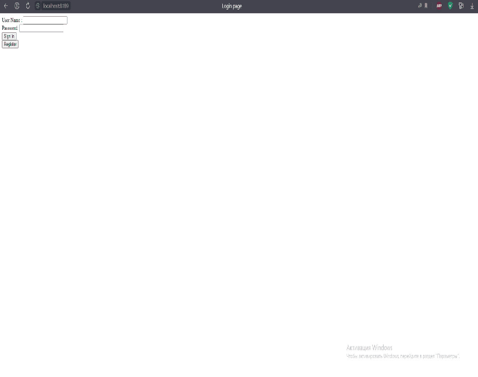

# Music Shop Website

## website created using :
- Spring Framework (Boot/Security)
- Teamplate engine Thymeleaf
- RDBMS PostgreSQL
- Database containing over 100 records
- ORM JPA

## Database structure

- orange tables are used for registration and authentication
- green tables are used to provide information to users about the assortment of the store
- red tables are used to provide information to admins

## Overview

## Features
- product information is taken directly from the database
- convenient search among products using different filters
- registration and authentication of the user with entering into the database
- a shopping cart for each user in which you can add products and remove products
- user's personal account in which he can enter his data as a customer